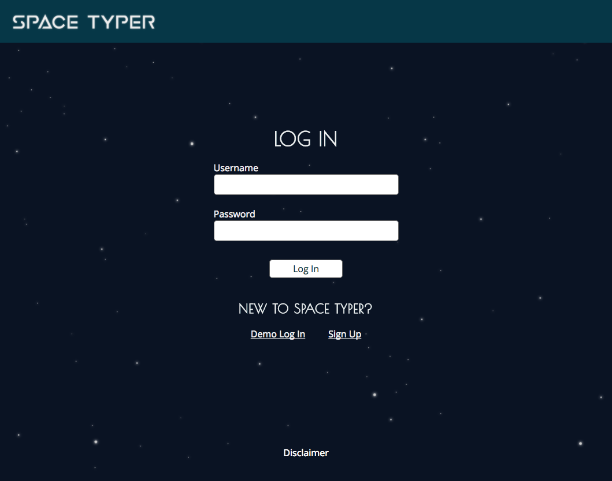

# SpaceTyper

[Live Site](http://www.spacetyper.com)

[Documentation](./docs)


## Table of Contents
[About](#about)

[Features](#features)
  * [Authentication](#authentication)
  * [Racing](#racing)
  * [User Stats](#user-stats)

[Next Steps](#next-steps)

## About

SpaceTyper is a TypeRacer inspired typing app, where the first player to finish typing a provided quote wins. This is a single page app built with Ruby on Rails and React. It uses a Redux state container to keep track of the front-end application state.

I used [Ruby on Rails](http://rubyonrails.org/) to set up a CRUD cycle API that stores users, quotes, and scores in the database and provides access to that data as JSON. Setting up the backend interface as an API that responds with JSON allowed me to use the [React](https://facebook.github.io/react/) library to render all of the data as HTML and setup the front-end navigation and functionality. I used [Redux](http://redux.js.org/) to control the application state. The TypeRacer app has many components that need access to the application state and Redux establishes a single predictable container for that state.

## Features

### Authentication



SpaceTyper uses session tokens and cookies to keep track of logged in users. User passwords are not stored directly in the database. The app converts them into password digests by attaching a salt to the raw password and running that through a hashing function. When a user logs in a session token is stored both in the database and as a cookie in the user's web browser. The front-end part of the application keeps track of the current user by setting the current user's id and username to the state.

### Racing


Users enter typing races and compete against computer players with random words per minute speeds. When the race is complete the user's score is posted to the database.

The race is contained within a component that has access to the Redux store. The Race component also has its own component state and it's responsible for setting up and performing most of the time and sequence dependent events.

A significant amount of the SpaceTyper app behaves asynchronously and depends on synchronous event ordering. This presented a couple of interesting challenges. I needed to perform asynchronous tasks and have components render smoothly (without waiting for those asynchronous tasks), but I also needed game-play to happen in a synchronous manner. I also needed to make state changes at appropriate times, and often one state change depended on another.

To make sure components would render smoothly I implemented default states and updated those states with lifecycle methods in the components.

##### Lifecycle methods from the race component demonstrate asynchronous state updates followed by synchronous game-play actions:
```javascript
// Fetch a random quote. After it's fetched start the race countdown
componentDidMount() {
  this.props.fetchRandomQuote().then(res => this.countDown());
}

// When the new quote information is received update the state
componentWillReceiveProps(newProps) {
  let text = newProps.quote.body.split(" ");
  let firstWord = text.shift();

  this.setState({
    quote: newProps.quote,
    current: firstWord,
    remaining: text
  });
}

// When the user navigates away clear timers and reset quote state
componentWillUnmount() {
  this.timers.forEach(timer => {
    clearTimeout(timer);
  });

  this.props.resetQuote();
}
```

Ensuring that state changes happened at the appropriate time was a challenge, because setState behaves asynchronously. I addressed this by passing callback functions to the setState calls, so that those functions would execute after the state change was performed.

##### The submitScore function demonstrates callback chaining in setState:
```javascript
submitScore(time) {
  // Calculate time in minutes and word count for the quote
  const min = time / 60000;
  const wordCount = this.state.finished.length;

  // Store the user's WPM speed in the component state
  this.setState({ userWPM: Math.floor(wordCount / min) }, () => {
    // then: sort the user's WPM with the computer wpm scores
    let sortedWPMs = [this.state.userWPM, ...this.state.compWPMs]
      .sort((x, y) => {
        if (x < y) return 1;
        else if (x > y) return -1;
        else return 0;
      });

    // Store the sorted WPM scores in the component state
    this.setState({ wpms: sortedWPMs }, () => {
      // then: post the user's score to the database
      createScore({
        score: {
          wpm: wordCount / min,
          won: this.state.wpms.indexOf(this.state.userWPM) === 0
            ? true : false,
          user_id: this.props.session.currentUser.id,
          quote_id: this.props.quote.id
        }
      });
    });
  });
}
```

It is necessary to save the user's words per minute score and the sorted words per minute scores in the race component state, because various child components of the race component need access to those values. The user score to be submitted depends on both the user's WPM speed and the the user's finish place, and the user's finish place depends on the user's WPM speed. It is therefore convenient to setup a chain of events in which values are calculated and saved before moving on to the next calculation.

### User Stats


Each time a user completes a race their score for the quote is saved to the database. The score only contains a words per minute value, a boolean value for whether or not they won, and foreign keys for the user and quote it belongs to.

All of the statistics are calculated on the backend with SQL and/or Ruby and ActiveRecord before being sent to the front-end. I avoided using N+1 queries by retrieving all the information I needed in as few queries as possible.

##### Fetching the most recent scores and ordering by WPM. Includes user to avoid N+1 queries:
```ruby
@scores = Score.includes(:user).order('created_at DESC')
  .limit(10).sort { |x, y| y.wpm <=> x.wpm }
```

##### Fetching a random quote and its associated scores:
```ruby
@quote = Quote.order("RANDOM()").first
@scores = @quote.scores.where(user_id: current_user.id)
  .order('created_at DESC').limit(5)
@high_scores = @quote.scores.order('wpm DESC').limit(10)
```

##### Some queries were easier to do using custom SQL queries. The user stats are calculated with SQL:
```ruby
# Get total races, average WPM, and max WPM
user_stats = Score.find_by_sql([<<-SQL, user])
  SELECT
    COUNT(*) AS total_races,
    AVG(scores.wpm) AS avg_wpm,
    MAX(scores.wpm) AS max_wpm
  FROM
    scores
  WHERE
    scores.user_id = ?
SQL

# Get average WPM for the last ten races
avg_last_ten = Score.find_by_sql([<<-SQL, user])
  SELECT
    AVG(last_ten.wpm) AS avg
  FROM (
    SELECT
      *
    FROM
      scores
    WHERE
      user_id = ?
    ORDER BY
      created_at DESC
    LIMIT 10
  ) last_ten
SQL

# Extract values and query for total races won
user_stats = user_stats.first
avg_last_ten = avg_last_ten.first.avg
total_won = Score.where(user_id: user.id, won: true).count

@stats = {
  username: user.username,
  avg_wpm: user_stats.avg_wpm,
  avg_last_ten: avg_last_ten,
  max_wpm: user_stats.max_wpm,
  total_races: user_stats.total_races,
  total_won: total_won
}
```

## Next Steps

TypeRacer has real-time public races where users can race against each other. SpaceTyper is not intended to be a widely used app, so I did not implement public races, but it would be a great feature to implement with WebSockets using Rails 5's [Action Cable](http://edgeguides.rubyonrails.org/action_cable_overview.html).

There is one unfortunate side-effect of having all of the game logic handled on the front-end. Since scores are submitted from the front-end, a clever user could use an ajax request to submit their own score. If this was a production app I could address this by obscuring the score submission format and making the github repo private.
