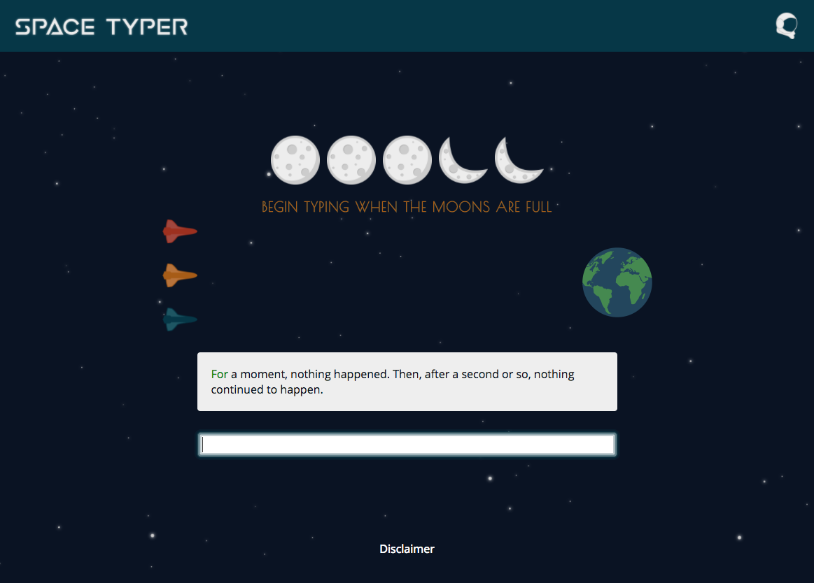

## Racing



Users enter typing races and compete against computer players with random words per minute speeds. When the race is complete the user's score is posted to the database.

The race is contained within a component that has access to the Redux store. The Race component also has its own component state and it's responsible for setting up and performing most of the time and sequence dependent events.

A significant amount of the SpaceTyper app behaves asynchronously and depends on synchronous event ordering. This presented a couple of interesting challenges. I needed to perform asynchronous tasks and have components render smoothly (without waiting for those asynchronous tasks), but I also needed game-play to happen in a synchronous manner. I also needed to make state changes at appropriate times, and often one state change depended on another.

To make sure components would render smoothly I implemented default states and updated those states with lifecycle methods in the components.

#### Lifecycle methods from the race component demonstrate asynchronous state updates followed by synchronous game-play actions:
```javascript
// Fetch a random quote. After it's fetched start the race countdown
componentDidMount() {
  this.props.fetchRandomQuote().then(res => this.countDown());
}

// When the new quote information is received update the state
componentWillReceiveProps(newProps) {
  let text = newProps.quote.body.split(" ");
  let firstWord = text.shift();

  this.setState({
    quote: newProps.quote,
    current: firstWord,
    remaining: text
  });
}

// When the user navigates away clear timers and reset quote state
componentWillUnmount() {
  this.timers.forEach(timer => {
    clearTimeout(timer);
  });

  this.props.resetQuote();
}
```

Ensuring that state changes happened at the appropriate time was a challenge, because setState behaves asynchronously. I addressed this by passing callback functions to the setState calls, so that those functions would execute after the state change was performed.

#### The submitScore function demonstrates callback chaining in setState:
```javascript
submitScore(time) {
  // Calculate time in minutes and word count for the quote
  const min = time / 60000;
  const wordCount = this.state.finished.length;

  // Store the user's WPM speed in the component state
  this.setState({ userWPM: Math.floor(wordCount / min) }, () => {
    // then: sort the user's WPM with the computer wpm scores
    let sortedWPMs = [this.state.userWPM, ...this.state.compWPMs]
      .sort((x, y) => {
        if (x < y) return 1;
        else if (x > y) return -1;
        else return 0;
      });

    // Store the sorted WPM scores in the component state
    this.setState({ wpms: sortedWPMs }, () => {
      // then: post the user's score to the database
      createScore({
        score: {
          wpm: wordCount / min,
          won: this.state.wpms.indexOf(this.state.userWPM) === 0
            ? true : false,
          user_id: this.props.session.currentUser.id,
          quote_id: this.props.quote.id
        }
      });
    });
  });
}
```

It is necessary to save the user's words per minute score and the sorted words per minute scores in the race component state, because various child components of the race component need access to those values. The user score to be submitted depends on both the user's WPM speed and the the user's finish place, and the user's finish place depends on the user's WPM speed. It is therefore convenient to setup a chain of events in which values are calculated and saved before moving on to the next calculation.
